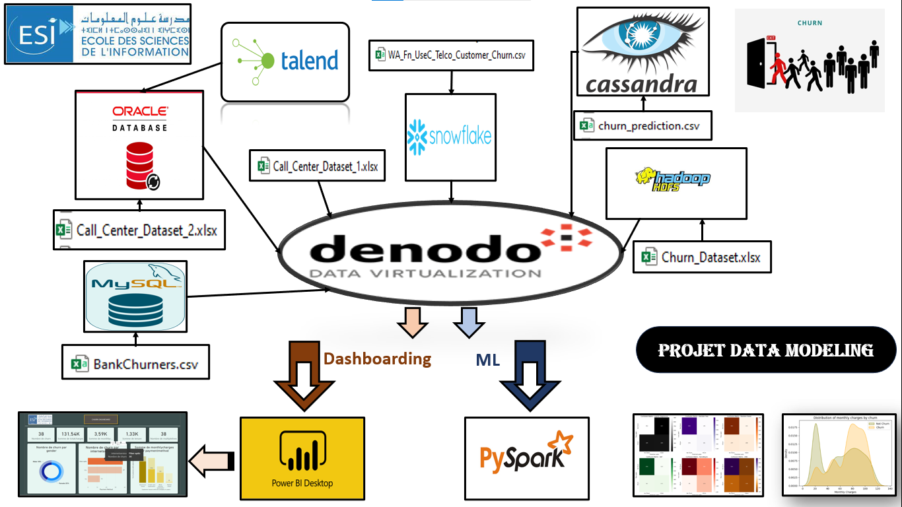

<u>Réalisé par:</u>

<ul >
    <li>ELGHAZI Soufiane</li>
</ul>
    

 

<h1 style='color:#4c4893' align='center'>
    Projet Data Modeling : Analyse et Prédiction de la Churn
</h1>

Le projet de data virtualisation que nous avons entrepris repose sur la mise 
en œuvre de Denodo en tant qu'outil central pour créer une couche abstraite 
permettant l'intégration transparente de données provenant de diverses 
sources. Dans le paysage complexe de la gestion des données, notre objectif est 
d'explorer les capacités de virtualisation offertes par Denodo pour faciliter 
l'accès, la gestion et l'analyse de données hétérogènes. Les différentes sources 
de données, allant des bases de données relationnelles classiques aux systèmes 
distribués Big Data, offrent un défi significatif que nous chercherons à résoudre 
en utilisant Denodo comme pierre angulaire de notre architecture.
Nous allons travailler avec des jeux de données pertinents sur le Churn ou 
désabonnement des clients, provenant de diverses sources telles que Snowflake, 
Oracle, Cassandra, Excel, MySQL et Hadoop (HDFS). Ces données variées 
reflètent la diversité des défis auxquels sont confrontées les entreprises 
modernes dans la gestion de leurs informations.

 

    

 

Dans ce Répértoir vous allez trouver les éléments suivants:
<ul>
    <li>BI: Le dashboard</li>
    <li>Data Les données utilisées 
    <li>ML: Ce dossier contient la partie de connexion avec Denodo , l'analyse exploratoir , la segmentation et la classification en utilisant spark mllib .</li>
    <li>Header.png:Image de miniature</li>
</ul>

<h1 style='color:#4c4893' align='center'>
    Fin
</h1>

